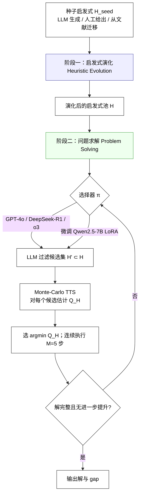
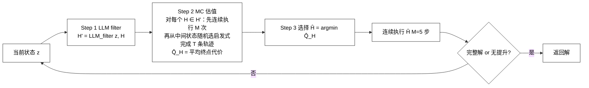

# HeurAgenix 文献阅读报告
**论文：** HeurAgenix: Leveraging LLMs for Solving Complex Combinatorial Optimization Challenges  
**作者：** Xianliang Yang, Ling Zhang, Haolong Qian, Lei Song, Jiang Bian（微软亚洲研究院；清华大学）  
**来源：** arXiv:2506.15196v2 [cs.AI], 24 Jun 2025  
**代码：** https://github.com/microsoft/HeurAgenix  
**数据集：** Hugging Face `VictorYXL/HeurAgenixDataset`（revision `6008adba8895821ad09b8a649ef2e74be67f725a`）  
**本次精读文件：** `/Users/duanzeyu/Desktop/文献/_bilingual/out/heuragenix_中英对照.pdf`（原 PDF：`自进化算法相关/2/2506.15196v2.pdf`，27 页）

---

## 0. 一句话总结
HeurAgenix 是一个 **两阶段 LLM 超启发式（hyper-heuristic）框架**：
1. **启发式演化阶段**：以 LLM 分析“种子启发式的解”与“更优扰动解”之间的对比，定位关键操作，让 LLM 解释改进原因并生成演化策略，再迭代改写启发式代码，得到一个多样化的启发式池（不需要外部求解器）。
2. **问题求解阶段**：LLM（GPT-4o 或微调后的 Qwen-7B）根据当前问题状态先筛选候选启发式，再用轻量 Monte-Carlo test-time scaling 对候选做 rollout 估值，选出当前最合适的启发式并连续执行 5 步。
3. **轻量选择器微调**：把启发式选择建模成 MDP/离线 RL 数据问题；用 Monte-Carlo 估值产生带噪的 Q 标签，用 **POR（偏好结果奖励）+ CPR（上下文感知奖励）** 双奖励做 GRPO + LoRA 微调，使 7B 小模型在噪声监督下也能稳定选出好启发式。

---

## 1. 研究背景与定位

### 1.1 问题背景
- 组合优化（CO）问题搜索空间随规模指数增长，传统精确求解器在大规模实例上不可行，工业界普遍依赖**启发式算法**。
- 启发式可解释、实用，但高度依赖人工经验，难以泛化到不同实例/问题。
- **超启发式（hyper-heuristic）** 自动设计或选择启发式，但往往仍需手工规则：
  - generation hyper-heuristics：自动组合操作/规则，但计算开销大、适应性差；
  - selection hyper-heuristics：从固定启发式集合中动态选择，但选择机制泛化难。
- LLM 用于 CO 的路线：
  - FunSearch、EoH、ReEvo：LLM 生成/进化启发式，但仍把启发式嵌入 task-specific solver（GLS/ACO 等），依赖领域知识；
  - AlphaEvolve：用 LLM ensemble 进化完整程序，去掉了外部求解器，但离线演化计算量大，且求解时不做实例级自适应。

### 1.2 本文定位（Table 1）
| 范式 | Heuristic Evolution | Problem Solving | 是否需要外部 Solver |
|---|---|---|---|
| FunSearch | LLM-driven | 固定启发式 | 是 |
| EoH | 5 个手工设计的演化策略 | 固定启发式 | 是 |
| ReEvo | 基于反馈的反思式改进 | 固定启发式 | 是 |
| AlphaEvolve | LLM ensemble 演化 | 固定启发式（离线） | 否 |
| **HeurAgenix（本文）** | **对比式、数据驱动演化** | **在线自适应选择 + TTS** | **否** |

**第一性声明：** 作者认为是首个同时做到 (i) 不依赖外部 solver 演化出一池多样化启发式；(ii) 在求解时引入在线启发式选择器（LLM 或微调小模型）的 LLM-based hyper-heuristic 框架。

### 1.3 主要贡献
1. 提出 HeurAgenix 统一框架：自动演化 + 在线选择，可扩展、可泛化，优于已有超启发式。
2. 提出**对比式、数据驱动的启发式演化**：从解轨迹中发现演化策略，无需预定义演化规则；并提出结合 LLM 与 test-time scaling 的自适应启发式选择。
3. 针对 CO 复杂、可靠监督稀缺的问题，提出**双奖励机制**：
   - Preference-based Outcome Reward (POR)：学习稳健偏好排序，而不是过拟合单个最优估计；
   - Context-Perception Reward (CPR)：奖励模型对当前问题状态的正确感知；
   两者联合，在噪声标注下稳定选择。

---

## 2. 问题形式化

| 概念 | 定义 |
|---|---|
| Problem state `z` | 对问题实例与当前（部分）解的高层抽象表示；静态特征（节点数、平均距离、图对称性等）+ 动态特征（已访问节点、当前路径代价等） |
| Heuristic `H` | 函数 `H: Z → O`，把状态 `z` 映射为一个操作 `O`；constructive heuristic 追加元素，improvement heuristic 交换/替换/扰动元素 |
| Transition `T` | 单步确定性转移 `z_{t+1} = T(z_t, O_t)`；扩展后 `T(z, H) = T(z, H(z))`；连续 M 步记为 `T^M(z, H)` |
| Solution trajectory | `S = {(z_i, O_i)}_{i=0}^{n-1}`，目标值 `C(S)` |
| Heuristic selector | `π(z, t) ∈ H`，在剩余 `t` 个决策的状态 `z` 下选择启发式 |

### 求解目标（Eq. 1）
对最小化问题：

```
V(z, t) = C(S_z)                                      if t = 0
          min_{H∈H} V( T^M(z, H), t-1 )               if M ≥ t > 0
Q(z, H, t) = V( T^M(z, H), t-1 )
π*(z, t) = argmin_{H∈H} Q(z, H, t)
```

- `N`：最大启发式调用次数；
- `M`：每次选中启发式连续执行的固定步数（论文全实验 M=5）；
- `t`：剩余决策次数（t=0 终止）；
- “启发式选择器优化”就是求最优 `π*`。

---

## 3. 总体流程（流程框图）

### 3.1 顶层两阶段

*阶段一是离线 LLM 演化（无需外部 solver）；阶段二是在线推理，可换用不同 LLM 或微调小模型。*

### 3.2 阶段一：启发式演化细节（Algorithm 1）

```mermaid
%%{init: {'theme':'base', 'themeVariables': {'primaryTextColor':'#000000','secondaryTextColor':'#000000','tertiaryTextColor':'#000000','textColor':'#000000','lineColor':'#333333','fontFamily':'trebuchet ms,verdana,arial,sans-serif'}}}%%
flowchart TD
    classDef default color:#000000,fill:#ffffff,stroke:#333333;
    S1[Step 1 基本解生成<br/>在 D_evo 上运行 H_seed 得 S 和 C S] --> S2[Step 2 对比解生成<br/>最多 P 次扰动：随机选操作子集 K，&#124;K&#124;/N=0.1<br/>把 O_k 替换为 O'_k 后 rollout]
    S2 --> S2b{C S' < C S ?}
    S2b -- 是 --> S3[把改动集合 M = &#123; z_k,O_k,O'_k &#125; 作为对比候选]
    S2b -- 否 / 达到 P 次仍无更优 --> S1
    S3 --> S4[Step 3 关键操作定位<br/>对每个改动单独替换，算 Δ_k = C S − C S^k<br/>k* = argmax Δ_k]
    S4 --> S5[Step 4 LLM 提取演化策略<br/>E = LLM_evolve H_seed, z_k*, O_k*, O'_k*<br/>LLM 解释 O'_k* 为什么更好]
    S5 --> S6[Step 5 迭代精炼<br/>H0=H_seed；最多 T_max=5 轮<br/>p_i = evaluate_performance H_i, D_val<br/>H_&#123;i+1&#125;=LLM_refine H_i,E,p_i；无提升则早停]
    S6 --> S7[输出 Hevolved]
    style S1 color:#000000;
    style S2 color:#000000;
    style S2b color:#000000;
    style S3 color:#000000;
    style S4 color:#000000;
    style S5 color:#000000;
    style S6 color:#000000;
    style S7 color:#000000;

```


**关键参数：**
- 演化实例集 `D_evo`：每问题 20 个训练实例；
- 验证集 `D_val`：每问题 7 个实例（MaxCut 为 g11–g20）；
- 最大扰动尝试 `P = 1000`；扰动比例 `|K|/N = 0.1`；
- 最大精炼轮数 `T_max = 5`；
- 所有 LLM-based 方法统一限制为 **2000 次 API call**。

**代码实现差异（重要）：** released code 中的 `HeuristicEvolver` 不是逐字实现 Algorithm 1。它先用 perturbation heuristic 生成 positive trajectory（更优）与 basic seed 的 negative trajectory，再让 LLM “identify bottlenecks”、提出操作、生成 suggestion，随后用 code generator + validation 迭代 refine。它是对论文算法的一种工程化/等价化实现，最终产物仍是“从 seed 演化出的新启发式代码”。复现时应记录这一差异。

### 3.3 阶段二：问题求解（LLM + TTS）


- Step 1：LLM 利用语义粗筛，把池子缩小到候选集 `H'`；
- Step 2：Monte-Carlo 估值；论文附录 D 的 Algorithm 3：
  1. 把测试启发式 `H_test` 连续执行 M 次；
  2. 在结果状态上不断随机选启发式执行，直到不能改善；
  3. 记录终点指标；重复 T 次后取均值 `Q_H = mean(metrics)`；
- Step 3：选 `Q̂` 最小的启发式并执行 M 步。论文全实验 M=5；
- LLM 模式 API call 数：`⌈N/M⌉ + 2`（2 次用于 problem description 和 heuristic pool introduction）；
- 当没有启发式能继续改进时停止。

### 3.4 阶段二可选实现：微调轻量选择器
**动机**：用 7B 级小模型替代每次在线调用 GPT-4o，降低延迟和成本，同时保持选择质量。

#### 3.4.1 离线数据收集
- 数据集单元：`(z, H, Q_H)`，其中 `Q_H` 由 3.3 的 Monte-Carlo pipeline 得到；
- 两类轨迹：
  - **Greedy trajectories**：每步选 `argmax Q_H` 的启发式 → 让模型看到近优决策；
  - **Stochastic trajectories**：每步随机选启发式 → 让模型看到非最优状态并学会恢复；
- 由于 rollout 数量有限，`Q_H` 本身带噪：相似启发式的估值可能顺序互换。Figure 5（`rd100`）显示：
  - 始终选 oracle 最好启发式；
  - 从 top 30% “正集”中均匀随机选，几乎达到 oracle；
  - 完全随机选明显更差。
  这说明“把正集与负集分开”比精确拟合单点 Q 更重要 → POR 的动机。

#### 3.4.2 双奖励设计
**POR（Preference-based Outcome Reward，式 2）**  
把当前状态下所有启发式的 rollout 分数 `{Q_H}` 降序排序，启发式 `Ĥ` 排在第 `ℓ` 位。设 `n_pos < n_neg ≤ n=|H|`，分正集、负集、错误集：

```
λ = rank(z, Ĥ, {Q_H})

            ⎧ R_p * (1 - (ℓ-1)/n_pos),          1 ≤ ℓ ≤ n_pos
R_POR =     ⎨ -R_n * ((ℓ - n_pos)/(n_neg - n_pos)),  n_pos < ℓ ≤ n_neg
            ⎩ -R_L,                             n_neg < ℓ ≤ n
```

直觉：
- 正集内部线性插值，压缩小分数差 → 对正集内排序抖动不敏感；
- 正负边界处保留大跳变 → 只要启发式跨过正/负边界，就有强梯度；
- 错误集固定惩罚 `-R_L`。
Toy example（Table 2）：噪声扰动中间两个启发式分数时，Normalized Rank Reward (NRR) 几乎抹掉 H2/H3 的差距（0.2 vs -0.2），而 POR 仍保持明显间隔（0.5 vs -0.5）。

**CPR（Context-Perception Reward，式 3）**  
让模型先“看懂状态”，再决定启发式；即使最终奖励噪声很大，准确的状态感知本身也是有价值的学习信号：

```
R_CPR(z, ẑ) = Σ_i [ I(ẑ_i = z_i) * R_i^+ - I(ẑ_i ≠ z_i) * R_i^- ]
```

其中 `z=(z_1..z_m)` 是真实状态特征，`ẑ` 是选择器自己预测的状态特征，`I(·)` 为指示函数，`R_i^+>0, R_i^->0`。

**代码实现形式（released code）：** CPR 不是数值回归每个特征，而是让模型输出结构化卡片：
```
[problem card]: tsp / cvrp
[state card]: unvisited / partially visited / fully visited
[algorithm type card]: exploration / refinement
[cost card]: None / low cost / normal cost / high cost
```
`cards_reward_func` 对每张卡与真实标签比较给分/扣分；`[algorithm type card]` 还要求与所选启发式的类别自洽。论文式 (3) 是抽象框架，卡片奖励是其具体落地（属于论文-代码差异之一）。

**辅助奖励：** 输出格式（`<reasoning>`/`<answer>`/`***Run heuristic***` 结构）和 reasoning 语言一致性（英文，来自 DeepSeekMath 的设定）。

#### 3.4.3 训练算法（GRPO + LoRA）
**Algorithm 2（论文）**：
```
输入：离线数据集 D_offline；初始策略 π_θ0；权重 λ_POR, λ_CPR, λ_base
1 π_θ ← π_θ0
2 for epoch e = 1..M_epochs:
3   采样 mini-batch {z_k}
4   for each z_k:
5     从 π_θ 采样 G 条启发式序列 H_k^(g)
6     for g=1..G:
7       R_POR(z_k, H_k^(g))
8       R_CPR(z_k)
9       R_base(z_k, H_k^(g))
10      R_k^(g) ← λ_POR R_POR + λ_CPR R_CPR + λ_base R_base
11    for inner step u=1..μ:
12      Â_k^(g) = R_k^(g) − (1/G) Σ_g' R_k^(g')   # group-relative advantage
13      maximize GRPO objective (clip ε, KL penalty β)
输出：θ
```

**关键超参（论文附录 E，与 recovered `6e4fc66:src/training/config.py` 完全一致）：**
- 基座模型：**Qwen2.5-7B-Instruct-1M**
- LoRA rank α = 32；`use_gradient_checkpointing`
- 优化器：`paged_adamw_8bit`
- lr = 1e-6；Adam β1=0.9, β2=0.99；weight decay = 0.1
- cosine 调度；warmup ratio = 0.1；max grad norm = 0.1
- BF16（不支持则 FP16）；per-device train batch size = 1；gradient accumulation = 1；epochs = 1；max steps = -1
- 生成：vLLM，num_generations (NG) = 12；max prompt length = 2048；max completion length = 768
- recovered 代码中 MAX_SEQ_LENGTH = 3584

> 注意：GitHub 上另有一个 `NaDRO` 分支，其 `training/config.py` 是 3 epochs / grad accumulation 5 / max completion 4096 / max seq 8192，和这篇 HeurAgenix 论文附录不一致。复现这篇论文应使用 `6e4fc66` 的 `src/training/config.py`，NaDRO 分支只作为“同一训练方法的独立实现/参考”。

---

## 4. 实验设计

### 4.1 五类 CO 问题与数据
论文使用 5 个标准 benchmark，统一指标为 optimality gap：

```
gap = (v - v_u) / v_u × 100%
```

`v` 为得到解的目标值，`v_u` 为已知最优/最好已知值；每个求解实验跑 3 次降低方差；每个测试实例最多 2 小时。

| 问题 | 目标 | 数据源 | 训练 | 验证 | 测试 |
|---|---|---|---|---|---|
| TSP | 最小化路径长度 | TSPLIB | 20 generated | brg180, eil101, gr202, pr124, pr152, rd100, u159 | kroA100, kroA150, kroB100, kroB200, kroC100, bier127, tsp225, a280, pcb442, gr666, pr1002, pr2392 |
| CVRP | 最小化带容量约束的配送成本 | CVRPLIB | 20 generated | A-n63-k10, B-n67-k10, E-n76-k10, F-n45-k4, M-n101-k10, P-n70-k10, X-n101-k25 | A-n80-k10, B-n78-k10, E-n101-k14, F-n135-k7, M-n200-k17, P-n101-k4 |
| MKP | 最大化多背包总价值 | OR-Library（mknapcb1/mknapcb4） | 20 generated | mknap1_1 ~ mknap1_7 | mknapcb1_1~5, mknapcb4_1~5 |
| JSSP | 最小化 makespan | OR-Library（jobshop） | 20 generated | LA21~LA30 | LA01~LA20 |
| MaxCut | 最大化割边权重和 | Optsicom | 20 generated | g11~g20 | g1~g10 |

**各问题的基础启发式（Appendix E，也决定复现的 pool 组成）：**
- TSP：cheapest insertion, farthest insertion, greedy, GRASP, insertion heuristics, nearest insertion, nearest neighbor, random pairwise insertion, 2-opt, 3-opt → 演化 3 个种子：cheapest/farthest/nearest-neighbor。

> 命名对照注意：论文 Table 5 的 CVRP 列写的是 “Cheapest insertion”，但 released 代码中对应的 3 个演化种子文件是 `min_cost_insertion_048f / farthest_insertion_4e1d / nearest_neighbor_99ba`；复现时应以代码文件为准。
- CVRP：farthest insertion, greedy, min cost insertion, nearest neighbor, node shift between routes, petal, saving, 2-opt, 3-opt → 演化 farthest/min-cost/nearest-neighbor。
- MKP：block flip, greedy by cost benefit, greedy by density, greedy by least remaining capacity, greedy by profit-to-weight ratio, greedy by profit, greedy by resource balance, greedy by weight, greedy improvement, k-flip, single swap, 2-opt → 演化 profit/weight/density。
- JSSP：FCFS, least work remaining, longest job next, longest processing time first, most work remaining, shift operator, shortest job next, shortest processing time first, 2-opt, 3-opt → 演化 most-work/FCFS/SPT。
- MaxCut：balanced cut, greedy swap, highest delta edge, highest delta node, highest weight edge, most weight neighbors, multi swap 2, simulated annealing → 演化 most-weight-neighbors/highest-weight-edge/balanced-cut。

### 4.2 LLM 与参数
| 角色 | 模型 | 版本备注 |
|---|---|---|
| 演化 foundation model | GPT-4o | 2024-11-20 |
| 问题求解 primary selector | GPT-4o | 同上 |
| 对比的闭源 selector | OpenAI o3 | 2025-04-16 |
| 对比的闭源 selector | DeepSeek-R1 | — |
| 微调轻量选择器 | Qwen2.5-7B-Instruct-1M | 论文写作 Qwen-7B |
| 公平对比的 baseline | EoH / ReEvo 也用同一 GPT-4o | 避免底座差异 |

生成参数：temperature 0.7，top-p 0.95，max tokens 1600。

### 4.3 演化设置
- 每个问题的训练实例数：20；
- perturbation trials P = 1000；扰动量 |K|/N = 0.1；
- refinement iterations T = 5；
- 每种方法进化到 2000 API calls（HeurAgenix / EoH / ReEvo 同等比较）。

### 4.4 求解设置
- 每次选择后连续执行 M = 5 步；
- Monte-Carlo search times = 10（即附录 D 的 T=10，也是 Figure 9 的 rollout budget）；
- 问题状态上下文长度 = 1000；
- 单测试实例最多 2h；
- 平台：GNU/Linux, Intel Xeon, **4× NVIDIA RTX A6000 48G**, CUDA 12.2。

### 4.5 对比方法
| 问题 | Baselines |
|---|---|
| TSP | GLS, ACO, OR-Tools, EoH+GLS, ReEvo+GLS, ReEvo+ACO |
| CVRP | ACO, OR-Tools, ReEvo+ACO |
| MKP | QICSA†, PSO†, ACO, ReEvo+ACO |
| JSSP | ACO†, PSO†, GWO† |
| MaxCut | SS†, CirCut†, VNSPR† |

† 表示数字直接取自原论文/文献。

---

## 5. 主要结果

### 5.1 演化阶段（Figure 7 / Table 5）
代表性平均 gap（%）：

| 问题 | 种子启发式 | 演化前平均 gap | 演化后平均 gap |
|---|---|---|---|
| TSP | nearest neighbor | 24.59 | **9.06** |
| CVRP | nearest neighbor | 48.80 | **36.55** |
| MKP | greedy by density | 8.03 | **2.69** |
| JSSP | SPT first | 180.47 | **23.30** |
| MaxCut | balanced cut | 60.41 | **6.45** |

结论：即使非常基础的种子启发式，经过自动演化也可成为有竞争力的求解器；TSP 上与 EoH/ReEvo 相比，HeurAgenix 演化后的 nearest neighbor 平均 gap 9.06%，优于 EoH 17.15% 和 ReEvo 15.94%。

### 5.2 阶段二：GPT-4o 在线选择（Figure 8 / Table 6，平均 gap %）
| 问题 | HeurAgenix (Ours) | 最强 baseline |
|---|---|---|
| TSP | **0.50** | ReEvo+GLS 0.98；EoH+GLS 1.93；GLS 3.93 |
| CVRP | **6.49** | OR-Tools 9.57；ReEvo+ACO 21.62；ACO 43.00 |
| MKP | **0.68** | ReEvo+ACO 5.20；QICSA 5.26；PSO 8.28 |
| JSSP | **0.25** | GWO 0.37；ACO 0.42；PSO 1.19 |
| MaxCut | 0.60 | CirCut 0.07；SS 0.38（HeurAgenix 第三） |

结论：HeurAgenix 在 TSP/CVRP/MKP/JSSP 上匹配或超过专用求解器；MaxCut 上弱于 SS/CirCut，但仍优于 VNSPR。

### 5.3 阶段二：微调 Qwen-7B 作为选择器（Table 3/4，Figure 9）
Table 3（13 个 TSPLIB 实例，平均 gap %）：

| Selector | 平均 gap |
|---|---|
| GPT-4o（zero-shot） | 0.61 |
| OpenAI O3（zero-shot） | **0.39** |
| DeepSeek-R1（zero-shot） | 0.45 |
| **HeurAgenix 微调 Qwen-7B** | **0.50** |

Table 4 消融（Qwen-7B）：

| 变体 | 平均 gap |
|---|---|
| raw Qwen-7B | 5.01 |
| vanilla GRPO | 4.39 |
| **POR + CPR** | **0.59** |

Figure 9：在 `pr152` 上，随着 rollout budget 增大，gap 持续下降；POR+CPR 微调选择器在所有预算下都优于基线。

---

## 6. 论文结论与未来工作
- 结论：HeurAgenix 端到端、LLM 驱动的超启发式，既可自动演化启发式池，又能在线选择；在标准 CO benchmark 上优于已有 LLM hyper-heuristic，并匹配/超过专用方法。
- Future work：
  1. 只测了 Qwen-7B backbone，未来扩到更多模型规模/架构；
  2. POR 的正/负分界目前手工设定，未来做自适应、数据驱动阈值；
  3. 该“有限操作空间、仅终端奖励”的序列决策思想可推广到更一般的 finite-state MDP。

---

## 7. 论文、代码、数据一致性核对（复现前必须知道）

> 详细清单见 `02_复现清单_HeurAgenix.md`，这里只列结论性差异。

1. **主仓库代码不是论文时刻的冻结版**  
   当前 `main` 最新 commit（`e84bfb1`, 2025-12-15）的 evolved heuristics、基础启发式文件名/实现都改过。论文 v2 日期是 2025-06-24；对应代码快照应取：
   - 核心实验：`f9ec60f`（2025-06-26 merge）或 `de8a9cf`（2025-06-24），两者 evolved heuristics 完全一致；
   - 微调实验：`6e4fc66`（2025-06-06）的 `src/training/*`、`collect_heuristic_selection_data.py`、`src/pipeline/heuristic_selection_data_collector.py`、`src/util/compare_heuristics.py`；这些文件在后来的 commit `8251fbe` 被删除，必须从 git 历史取回。
2. **Algorithm 1 的伪代码 ≠ 代码逐行实现**  
   代码使用 positive/negative trajectory + LLM 找 bottleneck + suggestion + refine 的工程实现；缺 “Δ_k 独立替换、选 k*” 那一步的逐字实现。要“严格 paper algorithm 复现”需要自己补一个 adapter。
3. **CPR 的论文公式与代码不同粒度**  
   论文 Eq. (3) 是逐状态特征的正确/错误奖励；代码 `cards_reward_func` 是四张定性卡片的奖励。训练数据中没有逐特征标签；复现时应以代码卡片奖励为主，同时说明这一替换。
4. **POR 的代码实现与公式不完全一致**  
   代码 `correctness_reward_func` 使用 `correct_answer` + `positive_samples`/`negative_samples` 的线性衰减；论文 Eq. (2) 使用排名 `ℓ`、阈值 `n_pos/n_neg`、错误区 `-R_L`。`n_pos/n_neg`、`R_p/R_n/R_L`、正负样本构造规则未在论文中给出，需要从收集数据中推断/校准。
5. **微调训练数据没有随仓库发布**  
   `dataset.py` 里数据路径是占位符；训练数据生成脚本（把 `round_*.txt` 变成 JSON）没有保留。必须根据 `collect_heuristic_selection_data.py` + `rewards.py` 的字段要求自行重建：
   `correct_answer, positive_samples, negative_samples, illegal, disabled_algorithms, card_problem, card_state, card_alg_type, card_cost`。
6. **数据集的 splits 不唯一/不干净**  
   HF dataset 的 `validation_data`/`test_data` 里包含论文未使用的实例（如 TSP `pa561`、`ts225`；CVRP Golden/Loggi/ORTEC；JSSP LA31~40；MKP PB/SENTO/mknapcb9；MaxCut 大量 g21+），且 `g1.mc` 同时存在于 validation/test，`g11~g20` 只出现在 raw `test_data`。必须按论文精确重建 split，并显式指定文件，避免 `search_file` 的“第一个匹配”歧义。
7. **TSP 的 `tsp225` 参考值用的是 3919**  
   released `analysis.py` 的 upper_bound 列表为：21282, 26524, 22141, 29437, 20749, 118282, 3919, 2579, 50788, 294358, 259045, 378032。若用 TSPLIB 官方最优值不同，gap 会和论文不可比；复现 Table 5/6 应使用论文仓库的参考值，并在报告中注明。
8. **启发式池组成有歧义**  
   代码的 `heuristic_type=evolved` 会把 evolved 目录 + basic 目录中“基名不重复”的启发式合并，得到更大的池；论文 Appendix E 只列 10 个左右“确定性”基础启发式，且 Table 5 说“All heuristics are deterministic”。需要做 pool 校准实验（3 evolved only / Appendix E pool / released combined pool），选与论文表格最一致的组合。
9. **外部 baseline 数字部分直接引用**  
   Table 6 中标 † 的数字来自原论文；EoH/ReEvo 只对 TSP nearest neighbor 开放演化接口。要真正复跑 GLS/ACO/OR-Tools/PSO/GWO/QICSA/SS/CirCut/VNSPR/EoH/ReEvo 需要另行适配，工作量和不确定性都很大。
10. **LLM 版本和 API 可用性**  
    GPT-4o 2024-11-20、o3 2025-04-16 可能在当前 API 中已不可用或行为漂移；DeepSeek-R1 版本也会变化。复现时必须记录实际调用的模型版本和日期，并区分“论文原模型”与“可用替代模型”。
11. **环境兼容性**  
    recovered training code 基于 2025 年中的 Unsloth + TRL GRPO + vLLM 0.7.3 接口；当前 pip 默认可安装的版本可能 API 已变。需要固定版本或把训练代码移植到当前 TRL GRPO，并做小规模 dry-run。
12. **参考上限与“已知最优”**  
    CVRP/MKP/MaxCut 的 upper_bound 是论文 `analysis.py` 中使用的参考值，不一定是官方最新 BKS。复现必须锁定同一份参考值。

---

## 8. 复现可行性结论（三档目标）

| 档位 | 内容 | 依赖 | 可行性 |
|---|---|---|---|
| **A 档：核心训练复现**（建议优先） | 用 released evolved heuristics 复现 Table 5 确定性结果；重建离线数据集；在服务器上 LoRA + GRPO 训练 Qwen2.5-7B，复现 Table 3/4 与 Figure 9 | 服务器 GPU + 数据 + 代码历史 | 高；无需外部 LLM API |
| **B 档：完整方法复现** | 在 A 档基础上，用 GPT-4o 重跑启发式演化（5 问题 × 3 种子，2000 API calls/次），再用 GPT-4o 复现 Table 6/Figure 8 在线选择 | GPT-4o（或等价）API key、预算、时间 | 中；LLM 版本漂移和调用成本是主要风险 |
| **C 档：严格全表复现** | 再复跑所有外部 baselines（GLS/ACO/OR-Tools/EoH/ReEvo/PSO/GWO/QICSA/SS/CirCut/VNSPR），重建 Table 6 全部对比 | 多个外部代码库、时间较多 | 低-中；不建议默认全做，可按需挑 2–3 个 baseline 做交叉验证 |

**结论：** 论文的核心创新（演化 + 选择 + 双奖励微调）在 released 代码和数据集支撑下是可运行的；但“逐 bit 完全一致”不现实，尤其涉及 LLM 采样、未公开训练数据和 API 版本。合理目标是 **A 档 100% 打通，B 档在提供 GPT-4o key 后尽量贴近，C 档用论文数值做参照并标注**。
