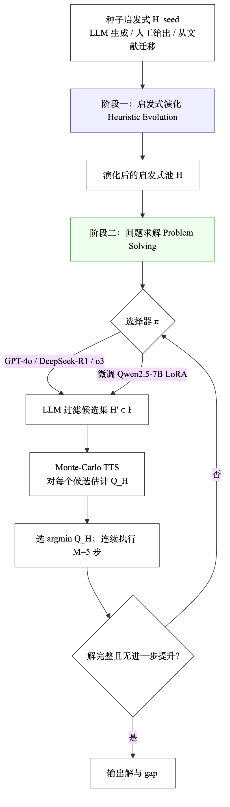
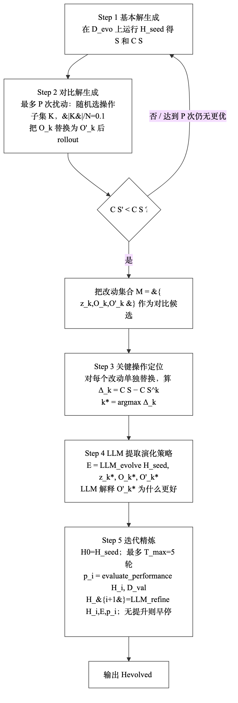
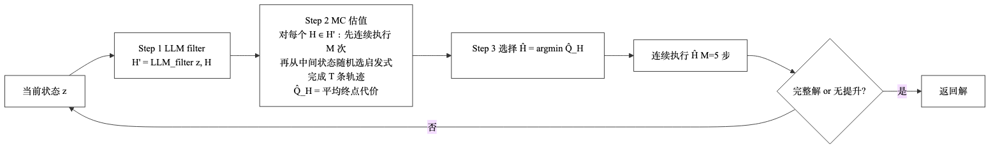
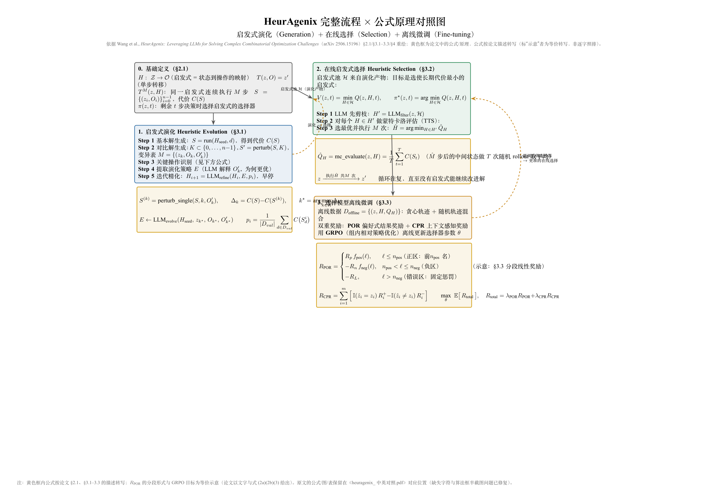
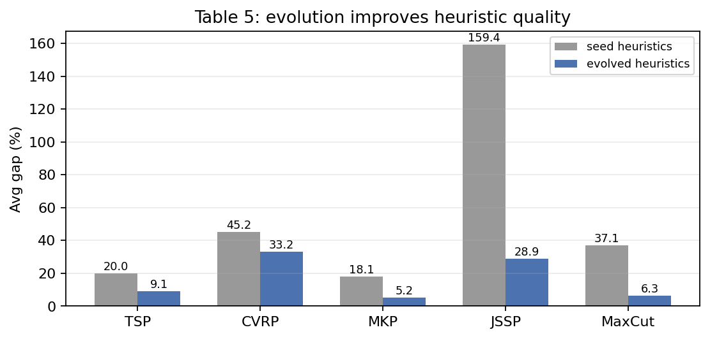
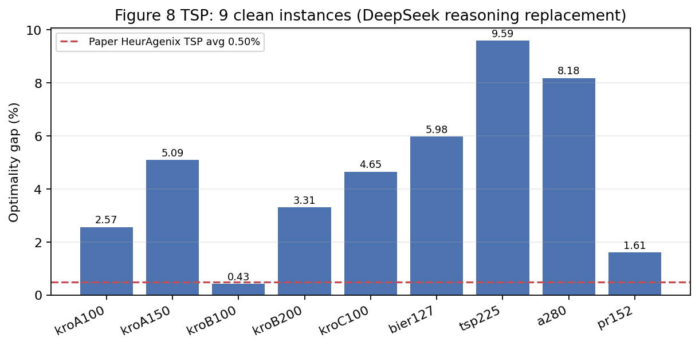
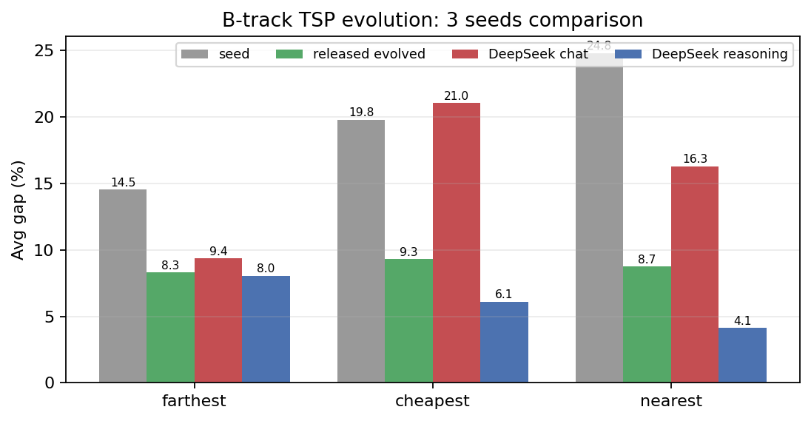
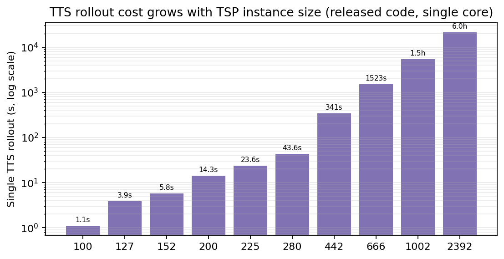

# HeurAgenix 论文复现与 EDA 迁移
## 组会报告 · 未读论文也能看懂的版本

- 日期：2026-09-23
- 对象：HeurAgenix（arXiv:2506.15196v2）
- 复现仓库：https://github.com/getm0ss1moving/heuragenix-repro

> **一分钟版本**：HeurAgenix 让 LLM 先“进化一批启发式算法”，再在求解时像“现场调度员”一样，每一步从池子里挑一个最合适的启发式执行，并用轻量蒙特卡洛试跑（TTS）估计哪个候选更好。它不依赖外部求解器，目标是自动设计 + 在线选择。

### 先看几个词（零基础速查）

| 术语 | 一句话解释 | 类比 |
|---|---|---|
| 组合优化 | 在巨大离散空间里找最优方案，如 TSP 最短回路 | 快递员要访问所有城市且路线最短 |
| 启发式 | 不一定最优、但能快速给出好解的规则 | 老司机的经验路线 |
| 超启发式 | 不直接解题，而是“管理和选择启发式” | 调度员给司机排班 |
| 在线选择 | 求解过程中根据当前状态动态挑启发式 | 堵车了临时换路线 |
| TTS | Test-Time Scaling，推理时多花算力试跑候选 | 发车前先模拟几条路线 |
| gap | 与已知最优解的相对差距，越小越好 | 比冠军慢了多少 |
| POR/CPR | 两种训练奖励：偏好结果 + 状态理解 | 既看结果，也看是否读懂路况 |

---

## 1. 论文要解决什么问题

传统方法做组合优化有三条路：

1. **专用求解器**（GLS、OR-Tools 等）：强，但每类问题要专家调参；
2. **手工启发式**：可解释，但难以适应不同实例和状态；
3. **LLM 直接生成解**：灵活，但容易“说得头头是道、算得不一定好”。

HeurAgenix 的定位：**不依赖外部求解器**，用 LLM 同时做两件事：

- **离线进化**：把弱种子启发式演化成更强的启发式池；
- **在线选择**：求解时按当前状态动态选启发式，并用 TTS 试跑评估候选。

> 关键区别：LLM 不直接输出最终解，而是输出“改写启发式代码”或“选择哪个启发式”。

---

## 2. 方法总览：两阶段框架

**阶段一（离线演化）**：输入种子启发式 H_seed（LLM 生成、人工给出或从文献迁移），通过“对比解 + 关键操作定位 + LLM 提取演化策略 + 迭代精炼”，产出更强的启发式池 H。

**阶段二（在线求解）**：每一步从 H 中选一个启发式，执行 M=5 次；候选由 LLM 过滤为 H'，再用 TTS 估计每个候选的未来代价，选最优者执行。循环直到解完整/无改进或达到步数上限。

> 为什么两阶段缺一不可：只有演化会得到“固定的强启发式”，但不同状态适合不同启发式；只有在线选择则池子太弱，TTS 也无从选起。

### 2.1 阶段一：启发式演化

演化一轮的五个步骤：

1. **基本解生成**：在演化实例集上运行 H_seed，得到轨迹 S 和代价 C(S)；
2. **对比解生成**：最多做 P 次扰动；每次随机选操作子集 K（|K|/N=0.1），把原操作替换成其他操作后 rollout；
3. **关键操作定位**：对每个改动单独替换，算 Δ_k = C(S) − C(S^k)，选 Δ 最大的 k*；
4. **LLM 提取演化策略**：让 LLM 解释“为什么 O'_k* 更好”，输出策略 E；
5. **迭代精炼**：从 H_seed 开始，每轮用 LLM_refine 生成 H_{i+1}，最多 5 轮，无提升则早停。

> 直觉：先找出“哪个小改动带来的收益最大”，再让 LLM 把这个改动背后的思路写成可复用的新启发式。

### 2.2 阶段二：在线选择与 TTS

把“选启发式”看成一个有限步决策问题：

- V(z, 0) = C(S_z)：没有剩余决策时，返回当前解代价；
- Q(z, H, t) = V(T_M(z, H), t−1)：在状态 z 执行 H 共 M 步后的动作价值；
- V(z, t) = min_H Q(z, H, t)：最优价值；
- π*(z, t) = argmin_H Q(z, H, t)：最优选择器。

真实 Q 值无法精确算，于是用三步步兵策略：

1. **LLM 过滤**：从完整池 H 中挑出候选子集 H'；
2. **TTS 估值**：对每个候选 H ∈ H'，先执行 M=5 步，再从中间状态随机选启发式补完 T=10 条轨迹；
   Q̂_H = (1/T) × Σ_(i=1..T) terminal_cost_i；
3. **选择与执行**：选 Q̂ 最小的启发式，连续执行 M=5 步。

循环直到解完整且无进一步提升，或达到最大启发式调用数 N；LLM 模式的 API 调用约为 ceil(N/M)+2 次。

### 2.3 双奖励微调：POR + CPR

在线选择器可以直接用大模型（GPT-4o / DeepSeek-R1 / o3），也可以微调轻量模型（Qwen2.5-7B LoRA）。由于 TTS 估值有噪声，论文用两种奖励：

- **POR（偏好结果奖励）**：把当前状态下各候选的 Q̂ 排序，按被选启发式的排名给正/负奖励，放大“好选择”和“差选择”的间隔；
- **CPR（上下文感知奖励）**：奖励模型正确理解问题卡片/状态卡片/算法卡片/代价卡片，类似“先看懂路况，再做选择”；
- 总奖励 R = λ_POR × R_POR + λ_CPR × R_CPR + λ_base × R_base，用 GRPO + LoRA 训练。

> 这张图来自论文流程 + 公式速查（中英对照），把两阶段、TTS、POR/CPR 的关系放在一张图里。

### 2.4 论文的关键实验设置

| 参数 | 论文取值 | 说明 |
|---|---|---|
| 每次选择执行步数 M | 5 | 越大越“坚持当前策略”，但适应慢 |
| TTS 采样次数 T | 10 | 每个候选做 10 次随机补全 rollout |
| 单实例运行时上限 | 2 小时 | 实验协议熔断上限，不是必须跑满 |
| TSP 测试实例 | 13 个，n=100…2392 | Appendix E 清单漏了 pr152，以 Table5/6 为准 |
| 选择器 | GPT-4o / o3 / DeepSeek-R1 | 另有微调 Qwen2.5-7B |
| 演化阶段 API 预算 | 每问题 2000 calls | 各方法统一 |
| 每个实验重复次数 | 3 次 | 用于降低方差 |

> 2h 的正确理解：它约束“每个测试实例整个求解阶段”，包含 LLM 筛候选 + TTS + 执行 M 步；自然停止优先，大实例里真正触发 2h 的是 TTS rollout 计算量。

---

## 3. 我们怎么复现的

- 代码 freeze：核心 f9ec60f + 训练代码 6e4fc66；
- 训练数据：按 released code 规则重建的离线数据 1109 条；
- 启发式池：P2，14 个（11 基础 + 3 released evolved）；
- 选择器：Qwen2.5-7B-Instruct-1M 的 raw / vanilla GRPO / dual POR+CPR LoRA；B 档改用 DeepSeek V4.1 Flash；
- 算力：225（4×RTX3090）主训练/评测，231（5×RTX4090）第二评测节点；
- 评测口径：A 档主表 k=0；k=10 只做 n≤225 子集；Figure8 用 DeepSeek reasoning 替代 GPT-4o。

| 对比项 | 论文 | 本复现 | 影响 |
|---|---|---|---|
| 在线 LLM | GPT-4o | DeepSeek reasoning | 行为/成本不同 |
| 训练数据 | 论文私有 | released 规则重建 1109 条 | 选择器质量有差距 |
| 启发式池 | 完整 evolved 池 | P2 近似 | 局部搜索强度有限 |
| TTS stop 口径 | 正文 completion、附录 improvement、代码 fixed2n | completion / improvement 对照 | 结果强依赖口径 |
| 重复实验 | 3 次 | 多数 1 次 | 只能读方向性 |

---

## 4. 复现结果

### 4.1 Table5：启发式演化确实有效

| 问题 | seed 平均 gap | evolved 平均 gap | 变化 |
|---|---|---|---|
| TSP | 20.04 | 9.11 | ↓ 10.93 |
| CVRP | 45.22 | 33.25 | ↓ 11.97 |
| MKP | 18.13 | 5.25 | ↓ 12.88 |
| JSSP | 159.39 | 28.92 | ↓ 130.47 |
| MaxCut | 37.06 | 6.35 | ↓ 30.71 |

论文代表性 TSP 最近邻：seed 24.59 → evolved 9.06；我们 seed NN 24.79 → released evolved NN 8.75，同量级吻合。结论：**演化阶段的可复现性最好**。

### 4.2 Table3/4：在线选择器仍有差距

| 选择器 | 论文 gap | 我们 k=0 | 我们 k=10 子集 |
|---|---|---|---|
| raw Qwen | 5.01 | 13.787 | 13.517 |
| vanilla GRPO | 4.39 | 13.098 | 14.456 |
| dual POR+CPR | 0.59 | 12.287 | 12.474 |

差距主要来自：论文用 k=10 + GPT-4o 级在线监督；我们主表用 k=0，训练数据是重建的，P2 池的局部搜索强度也有限。因此这里只能读“方向性”，不能直接声称论文结果不可复现。

### 4.3 Figure8 TSP：9 个干净实例逐实例结果

这是本报告最核心的新数据：每个实例单独列 gap，平均值只作辅助。

| 实例 | n | 我们的 value | gap % |
|---|---|---|---|
| kroA100 | 100 | 21828.0 | 2.566 |
| kroA150 | 150 | 27873.0 | 5.086 |
| kroB100 | 100 | 22236.0 | 0.429 |
| kroB200 | 200 | 30412.0 | 3.312 |
| kroC100 | 100 | 21714.0 | 4.651 |
| bier127 | 127 | 125358.0 | 5.982 |
| tsp225 | 225 | 4295.0 | 9.594 |
| a280 | 280 | 2790.0 | 8.181 |
| pr152 | 152 | 74866.0 | 1.607 |

- 9 实例辅助平均 gap = **4.601%（n=9）**；论文 HeurAgenix 基线 = 0.50%。
- 排除：pcb442（7500s timeout）、gr666/pr1002/pr2392（2026-09-23 09:30 用户指令停跑，无 completion）。

> 读图方法：柱子是每个实例的 gap；红色虚线是论文平均 0.50%。可以看到小实例接近论文，大实例和 tsp225/a280 差距明显。

### 4.4 B 档：DeepSeek 演化三 seed 对比

固定 2N+1 步协议，比较 seed / released evolved / DeepSeek chat / DeepSeek reasoning。

| seed | released evolved | DeepSeek chat | DeepSeek reasoning | reasoning n |
|---|---|---|---|---|
| farthest | 8.283 | 9.361 | **8.039** | 8/13 |
| cheapest | 9.307 | 21.020 | **6.090** | 12/12 |
| nearest | 8.747 | 16.288 | **4.134** | 12/12 |

结论：reasoning 在三个 seed 上都不差于 released evolved；nearest/cheapest 优势明显，farthest 优势很小，且 5 个大实例因 180s 超时只能标 INCOMPLETE。该结果属**方向性优势**，不是显著性结论。

### 4.5 运行时间：为什么大实例跑不完

- 每个 selection round 要做：1 次 LLM 筛候选 + 3 候选 × 10 次 TTS rollout；
- 每次 rollout 从当前状态随机选启发式补到完整解，单步可能是 2-opt/3-opt/SA；
- 实测单次 rollout：n=152 约 5.8s，n=225 约 23.6s，n=442 约 341s，n=666 约 1523s，n=1002 约 1.5h，n=2392 约 6h；
- 因此 n≥442 时，单轮 TTS 就可能超过论文的 2h 上限；这也解释了当前 3 个大实例长期停在 step_0。

> 论文主表很可能没有对所有大实例使用 k=10 全量 TTS：released 代码默认 b=0（不做 TTS），Figure 9 才专门研究 rollout budget k。2h 是“上限”，不等于“k=10 一定在 2h 内跑完”。

---

## 5. 结论与洞察

1. **演化阶段最稳**：Table5 五个问题全部明显下降，与论文趋势一致；
2. **在线选择是最大差距**：Table3/4 和 Figure8 都受模型替代、P2 池强度、k 口径和训练数据影响；
3. **TTS 是运行时间主瓶颈**：大实例单轮成本可达小时级，2h 熔断经常先触发；
4. **停止口径必须写清楚**：正文 completion、附录 improvement、released fixed2n 三处不一致，会把 gap 差出几十个百分点；
5. **对 EDA 的启发**：把“启发式”换成布局布线 skill，把“在线选择”换成带门控的 skill selector，把 TTS 换成多保真快速复算，就能形成 EDA 版 HeurAgenix（HA-PR）。

> 组会一句话：这篇论文的价值不在某个单点技巧，而在“离线演化 + 在线选择 + TTS 验证”的闭环；我们复现了闭环骨架，但大实例的 TTS 成本和论文口径仍是后续要解决的问题。

---

## 6. 组会讨论问题

1. 在线选择是否一定要用 TTS？如果直接 LLM 选（k=0），速度大幅提升，但质量损失多大？
2. 对 EDA，TTS 该怎么替换成低成本的多保真评估（sta/route estimate/HPWL）？
3. POR/CPR 双奖励在 EDA gate-safe 约束下应该如何改造？
4. 大实例（n≥442）是否应该换策略：限制候选池、只对便宜启发式做 rollout，或按阶段分治？
5. 论文的 2h 与我们的 stop 口径差异，最终报告应该采用哪套 fairness 协议？

---

## 7. 复现资产与快速入口

| 内容 | 位置 |
|---|---|
| GitHub 仓库 | https://github.com/getm0ss1moving/heuragenix-repro |
| Figure8 9 实例数据 | evidence/fig8_tsp_225/ |
| B 档三 seed 数据 | evidence/b_reason_*_final.json / *.csv |
| Table5 数据 | evidence/table5/table5_full_corrected.csv |
| Table3/4 k0 / k10 | evidence/eval/k0_combined.csv / k10_subset.csv |
| EDA harness | eda/harness/ 与 eda/docs/RUNBOOK.md |
| 本报告图片 | images/flow_*.png、images/chart_*.png、images/paper_flow_formulas.png |

> 组会后如果只记一件事：HeurAgenix 的两阶段骨架 + TTS 在线选择是可迁移的；我们下一步应优先解决“低成本 TTS / 多保真评估”和“停止口径 fairness”。
